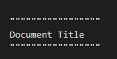

reStructuredText Example
""""""""""""""""""""""""

How To Create Document Title - 
""""""""""""""""""""""""""""""

To create Document Title you have to put double quote(") sign on top and bottom of the text, like 

It will be shown Like this in your Documentation -    

""""""""""""""
Document Title
""""""""""""""
**This is a break ...**

`XML Documentation`_ - 
.. _XML Documentation: https://github.com/mintosays/rtd-tutorial/blob/main/docs/source/PDCL.ERP2.Shell.xml